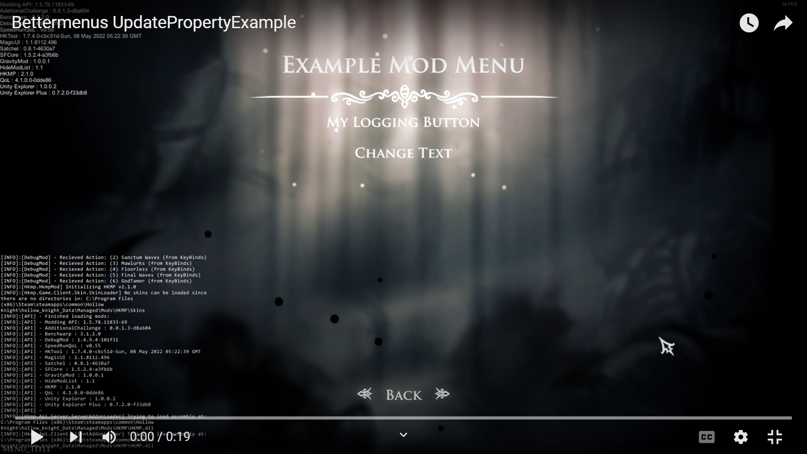

# Better Menus

## What is Satchel Better Menus
In 1.5, the MAPI added the ability for mods to add a menu to the "Mods" menu in game. The MAPI has 2 ways to create a modmenu, `IMenuMod` and `ICustomMenuMod`.  
`IMenuMod` is really simple to create but it is limited as it only allows a list of horizontal selections (basic dropdown like selections without a drop down that allow you to choose 1 option from a list) as it is mainly used across HK menus.  
`ICustomMenuMod` allows the mod to use a full range of menu elements at the cost of being hard to understand.
Satchel Better Menus is built to allow mods to use IMenuMods simplicity while allowing ICustomMenuMods flexibility and more

## List of Better Menus Features
It essentially can do what ICustomMenuMod does and more but with much more easier and cleaner code.
1. Easily create menus with 7 different menu elements - Horizontal Option, Static Panel, Text Panel, Menu Button, KeyBind, ButtonBind, Slider
2. Update properties of elements at will by just editing a property and calling the update function.
3. Hide/show menu elements at will. This allows "filtering" elements based on the current options selected by user. For example, if you have 3 gameplay modes in your mod, you can use this to only show the options relevant to that mode.
4. A `MenuRow` elements that allows you to place multiple menu elements side by side on a single horizontal line.
5. Blueprints for more easily creating commonly used configurations
6. Provides events like OnBuilt and On Update Menu.

Each of the features will be detailed below 

### 1. Create Menus with 7 Different Elements
To create satchel menus, there are 3 objects we need to define first.
1. `MenuScreen` It is the object that MAPI needs to display your screen to the user. The final return statement to create a modmenu requires you to return a menuscreen
2. `Menu` It is the object that satchel created to make making menus easier. This will be referred to as `MenuRef` to avoid confusion. 
3. `Menu Element` It is the parts that make up the menu (buttons, keybinds etc.)

To Create Menus:
Make the class that inherits from `Mod` also inherit from `ICusomMenuMod`. You'll be asked to create a function `GetMenuScreen`. In that function do:
```cs
// a variable that holds our Satchel.BetterMenu.Menu for us to use in the code.
private Menu MenuRef;

//function required to be created when inheriting from ICustomMenuMod.
public MenuScreen GetMenuScreen(MenuScreen modListMenu, ModToggleDelegates? modtoggledelegates) 
{
    //Create a new MenuRef if it's not null
    MenuRef ??= new Menu(
                "My Mod Name", //the title of the menu screen, it will appear on the top center of the screen 
                new Element[]
                {
                    //add elements here  
                }
    );
    
    //uses the GetMenuScreen function to return a menuscreen that MAPI can use. 
    //The "modlistmenu" that is passed into the parameter can be any menuScreen that you want to return to when "Back" button or "esc" key is pressed 
    return MenuRef.GetMenuScreen(modListMenu);
}
```

where you see `//add elements here` you can add elements based on what you need. the 7 elements will be detailed on [Better Menu Elements Page](elements.md)

To add lets say a MenuButton that logs when  that button was pressed you would do
```cs
new Element[]
{
    new MenuButton("My Logging Button", "A menu button", (_) => Log("A button was pressed")),
}
```

Below that you can add how many elements you want using `new {Element Name}(),`. If the element count exceeds 5, satchel will create scrollbar for you.
> Notice how I didn't manually specify an Id. If it is not specified, the Id will be the name of the element
### 2. Updating properties of elements
Lets say you wanted to add another option in HorizontalOption or wanted to change what the menu button description says after you press it.
All you'd have to do is 
```cs
//find the element by ID. 
Element elem = MenuRef.Find("My Logging Button");

//cast the element as a menubutton
BetterMenus.MenuButton buttonElem = elem as BetterMenus.MenuButton;

//change a property of the element
buttonElem.Description = "My New MenuButton";

//update menu to reflect changes
MenuRef.Update();
```

This can be done anywhere and it will reflect in the modmenu. If you want to do it on MenuButton press, do this code in the `submitAction` Action parameter. Similarly, if you want to do it when the selected option in HorizontalOption is changed, do the code in `ApplySetting` Action<int> parameter.

Example:
```cs
MenuRef ??= new Menu("Example Mod Menu",
        new Element[]
        {
            new MenuButton("My Logging Button", "A menu button", (_) => Log("A button was pressed"), Id:"Button1"), // create a button very similar to above button
            new MenuButton("Change Text", "Click me to change text of above button", (_) =>
                {
                    //find element by Id
                    Element elem = MenuRef.Find("Button1");
                    MenuButton buttonElem = elem as MenuButton;
                    buttonElem.Name = "My New MenuButton"; //change name
                    buttonElem.Description = "An old button with new properties"; //change description
                    MenuRef.Update();
                    
                    Log("Name of above button changed"); //add a log to know my code worked
                }),
        });
```
This code produces the following modmenu
[](https://youtu.be/IlXgQSa3zTs)
> Notice: Since I'm changing the name, I manually specified Id so there is no confusion.  

> Note: The compiler might get an ambiguous reference between UnityEngine.UI.MenuButton and Satchel.BetterMenus.MenuButton. Best to do `using Satchel.BetterMenus` on the top to avoid this error
### 3. The MenuRow Element
### 4. Hide/Showing Elements
### 5. Blueprints
### 6. Events